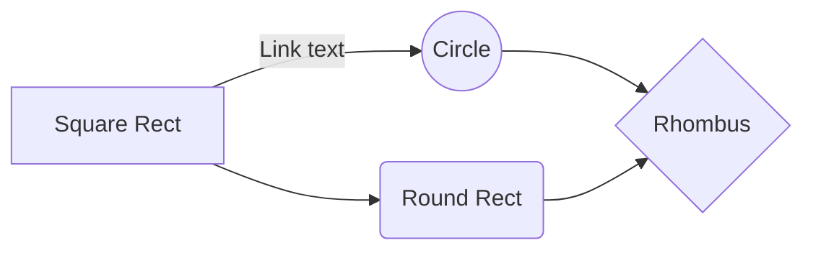

그래 어디 수식 되는 기념으루다가 maxwell 방정식이나 조져보자.

기호에 대해 설명하면, $E$는 전기장 $B$는 자기장이다.
$$
\begin{align}
    \nabla \cdot \mathbf{E} &= \frac{\rho}{\varepsilon_0} \\  
    \nabla \cdot \mathbf{B} &= 0 \\  
    \nabla \times \mathbf{E} &= -\frac{\partial \mathbf{B}}{\partial t} \\  
    \nabla \times \mathbf{B} &= \mu_0 \mathbf{J} + \mu_0 \varepsilon_0 \frac{\partial \mathbf{E}}{\partial t}  
\end{align}
$$
참고로 나는
$$
\nabla \cdot \mathbf{B} = 0
$$
젤 예쁘다

오 그럼 머메이드 테스트


스크립트에 머메이드를 넣어 보았다


<pre class="mermaid">
graph LR
  a --- b & c --- d
</pre>
<script src="https://cdn.jsdelivr.net/npm/mermaid@10.9.1/dist/mermaid.min.js"></script>
코드블록 효과는 잘 되나?
```
y=ax+b
```
